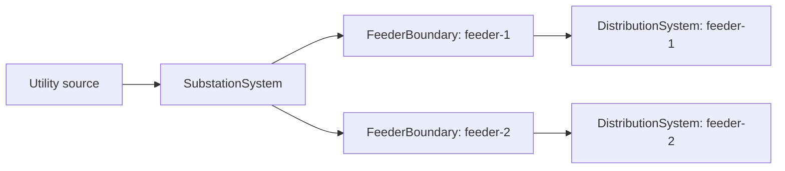

# System Models

GDM has two system containers for two different engineering views of the grid.
They share the same component-registration and persistence foundation, but they
do not represent the same network boundary.

| Choose this model | It owns | Typical contents |
| --- | --- | --- |
| [`DistributionSystem`](distribution.md) | Distribution-network connectivity and feeder analysis | Distribution buses, feeders, lines, loads, DER, voltage sources, and time series |
| [`SubstationSystem`](../api/substation.md) | Facility topology and station equipment | Substations, voltage levels, bays, bus sections, breakers, transformers, protection, metering, and station automation |

`DistributionSubstation` is a grouping component inside a distribution model. It
does not replace `SubstationSystem`, which models the station's internal bays,
bus arrangement, and equipment.

## How They Fit Together

A substation can feed one or more distribution feeder models. Keep these models
separate when they are owned, built, or updated independently. When an analysis
needs one connected network, join them at explicit feeder boundaries:

`FeederBoundary.feeder_id` matches a `DistributionFeeder.name`. When assembling
a complete network, `source_equivalent_id` names the feeder's root bus in its
distribution model. The station and feeders can then be combined with
`SubstationSystem.to_distribution_system()`.

There are two common workflows:

1. **Expand one station in an existing feeder model.** Replace a distribution
   transformer with a detailed substation using
   `DistributionSystem.replace_transformer_with_substation()`.
2. **Assemble a complete station and feeder set.** Keep the station and feeder
   models separate, then combine them with
   `SubstationSystem.to_distribution_system()` when a unified model is needed.

See [Distribution System](distribution.md), [Substation System](../api/substation.md),
and [Connecting Systems](connecting-systems.md) for the corresponding code and
validation rules.