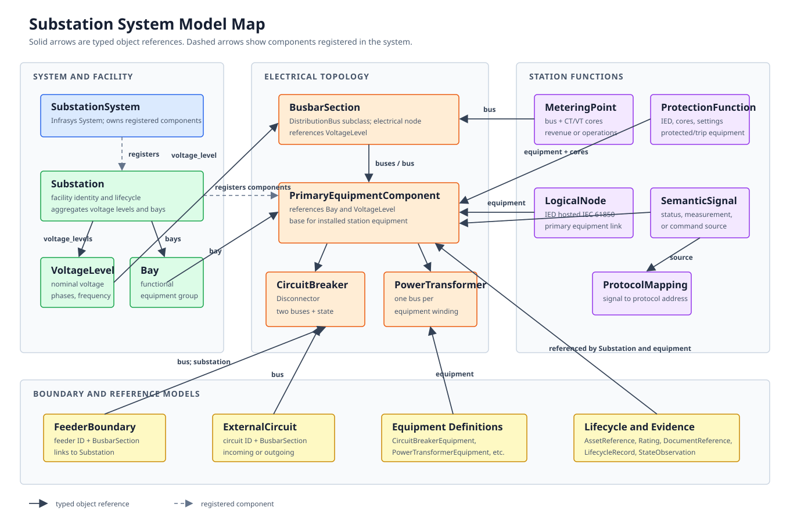

# Substation System

The canonical substation namespace is `gdm.systems.substation`:

```python
from gdm.systems.substation import (
    CircuitBreaker,
    PowerTransformer,
    SubstationSystem,
)
```

`SubstationSystem` is the authoritative data model for utility station topology
and station data. It covers distribution substations, wind collector
substations, solar collector substations, hybrid renewable substations, and
colocated energy storage interfaces.

## Ownership Boundary

`DistributionSystem` owns feeder-level analysis: distribution buses, lines,
loads, DER, feeder topology, and distribution time series. `SubstationSystem`
owns station topology and design: substations, voltage levels, bays, busbar
sections, primary equipment, protection, metering, station automation, SCADA
mappings, and renewable plant interconnection profiles.

Station topology uses the same bus-branch design as `DistributionSystem`.
Electrical nodes are `BusbarSection` instances, which subclass `DistributionBus`
and use the inherited geographic `coordinate` for mapping. Installed equipment
references the nodes it connects directly through typed `buses` (series) or
`bus` (shunt) fields; there
are no string terminal or connectivity-node IDs inside the station. Cross-system
references (distribution feeder IDs, plant IDs, protocol addresses) remain
strings.

`SubstationSystem.get_undirected_graph()` returns a NetworkX bus-branch graph
whose nodes are busbar sections and whose edges are state-aware primary
equipment, ready for SCADA binding.

## Model Relationships

The diagram separates system registration from the typed object references that
carry facility structure and electrical connectivity. It presents the core
models plus representative protection, metering, and automation links; the
corresponding reference models are shown as a grouped boundary.



## Scope

The current datamodels include:

- station topology: substations, voltage levels, bays, busbar sections (nodes), feeder boundaries, and bus-branch primary equipment;
- primary equipment: breakers, disconnectors, earthing switches, power transformers, instrument transformers, and surge arresters;
- protection: IEDs, functions, schemes, setting groups, settings, and test records;
- automation: IEDs, IEC 61850 logical nodes, SCL metadata, semantic signals, and DNP3/IEC 60870/IEC 61850 mappings;
- metering and power quality: instrument-transformer cores, metering points, meter tests, and PQ monitors;
- renewable interfaces: collector feeders, plant controllers, IEEE 1547/IEEE 2800 profiles, solar/wind plant references, and energy-storage interfaces;
- lifecycle and evidence: asset references, external identifiers, ratings, standards profiles, document metadata, lifecycle records, and state observations.

SCL, relay-settings, SCADA, and study files are represented by metadata and
hash/URI references only. File parsing and external utility integrations are
outside the current scope.

## Plotting

- `SubstationSystem.to_gdf()` returns a combined GeoDataFrame containing point
  records for positioned busbar sections and line records for connected primary
  equipment. It can also export the table as CSV.
- `SubstationSystem.to_geojson(path)` exports the same topology as GeoJSON.
- `SubstationSystem.plot()` renders the GeoDataFrame as an interactive map. Its
  node and edge color choices, map type, map style, legend control, zoom level,
  and directory-based HTML export follow `DistributionSystem.plot()`; coordinate
  flipping is not supported for substation maps.

## Standards Profiles

The model is generic by default. Projects can associate applicable editions and
authorities with `StandardProfile`, including profiles based on:

- [IEEE 1547-2018](https://standards.ieee.org/standard/1547-2018.html) for distribution-connected DER;
- [IEEE 2800-2022](https://standards.ieee.org/standard/2800-2022.html) for transmission/subtransmission IBR interfaces;
- [IEEE C37.2-2022](https://standards.ieee.org/standard/C37_2-2022.html) for protection and device function vocabulary;
- [IEC 61850](https://webstore.iec.ch/en/search?query=IEC%2061850) and IEC 61850-6 for station automation and SCL;
- [IEC 61970/61968 CIM](https://webstore.iec.ch/en/search?query=IEC%2061970-301) for utility information-model exchange;
- [IEEE 519-2022](https://standards.ieee.org/standard/519-2022.html) and IEC 61000 profiles for power quality.

Standards applicability, adopted editions, utility requirements, and authority
having jurisdiction remain project data rather than global assumptions in the
model.
